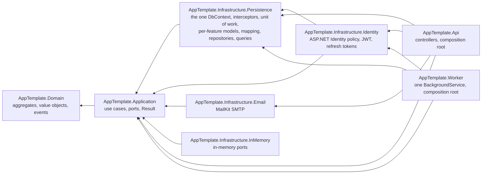

# Architecture

A Clean Architecture layout for a .NET 10 HTTP API. This document records the
decisions and, more usefully, the reasons — including the things this template
deliberately does **not** do.

One decision per file, with its alternatives, lives in [adr/](adr/README.md). This
page is the map; the ADRs are the argument.

## The four layers and the dependency rule

Source dependencies point inward, always. Nothing in an inner layer knows an outer
one exists.

| Layer | Project(s) | Contains | May reference |
|---|---|---|---|
| Domain | `AppTemplate.Domain` | aggregates, value objects, domain events, invariants | **nothing** |
| Application | `AppTemplate.Application` | use cases, ports, `Result`/`Error`, DTOs, validators | Domain |
| Infrastructure | `AppTemplate.Infrastructure.*` | EF Core, PostgreSQL, ASP.NET Identity, JWT, SMTP | Application (→ Domain) |
| Presentation | `AppTemplate.Api`, `AppTemplate.Worker` | controllers or a background service, composition root, host concerns | Application + the modules that host needs |



`AppTemplate.Domain` having **no packages at all** is the load-bearing constraint. It is what
makes the domain testable with no host, no database and no mocking framework, and it
is the first thing to check in review. Verified: `AppTemplate.Domain.csproj` has zero
`PackageReference` and zero `ProjectReference` entries.

Two rules that a compiler cannot state on its own, so state them here:

- **Modules reference `Persistence`, never the reverse.** `Persistence` owns the
  mechanics of saving; it must not know which capabilities exist.
- **Modules do not reference each other.** Anything two modules both need belongs in
  Application (as a port) or in Persistence (as mechanics).

Direction is enforced by the project graph, and is worth an architecture test —
`NetArchTest.Rules` is pinned in `Directory.Packages.props` for exactly that — so a
casual `using` cannot quietly invert it.

## Ports are named for business intent, not for technology

A port is an interface **declared in Application** and **implemented in
Infrastructure**. Its name says what the application needs, not what supplies it:

| Port (Application) | Implementation (Infrastructure) |
|---|---|
| `ITodoListRepository`, `IReminderRepository` | EF Core repositories over `AppDbContext` |
| `ITodoListQueries`, `IReminderTargets` | EF Core projections to DTOs |
| `IUnitOfWork` | one `SaveChangesAsync` on `AppDbContext` |
| `IEmailSender` | `MailKitEmailSender` |
| `ICurrentUser` | `CurrentUser`, reading `HttpContext` claims |
| `IDateTimeProvider` | `SystemDateTimeProvider` |
| `IUserAccounts` | `UserManager` / `SignInManager` wrapper |
| `IEmailConfirmationTokens` | ASP.NET Identity's default token provider |
| `IAccessTokenIssuer` | signed JWT over the account's current claims |
| `IRefreshTokenGrants` | opaque rotating grants over `IRefreshTokenStore` |
| `IConfirmationEmailComposer` | HTML template plus the confirmation URL |

There is no `IEfCoreRepository`, no `ISmtpClient`, no `IHttpContextWrapper`. The
point of the seam is that the application layer can be read, and tested, without
knowing that EF Core, MailKit or ASP.NET Identity exist. A port named after its
implementation has already given that away.

The authentication ports are the interesting ones. There are ten of them rather than
one `IAuthService`, and the split is what keeps the *sequencing* in Application:
`RegisterUseCase` creates the account, then mints a confirmation token, then composes
and sends the mail through `IEmailSender`, and decides that a delivery failure is a
success carrying `confirmationEmailSent: false`. `RefreshAccessTokenUseCase` rotates
the presented grant, then revalidates the account, then revokes the whole family if it
may no longer sign in. Each port is one capability an adapter can satisfy on its own,
and the ASP.NET Identity types (`AppUser`, `UserManager<>`) never appear in
Application. An architecture test asserts that no port grows wide enough to take the
sequencing back.

## Infrastructure is split per capability, with no per-technology sub-split

Each capability gets one project, one DI extension method, and — where it needs
storage — one DbContext in one schema:

| Module | Registers | Storage |
|---|---|---|
| `AppTemplate.Infrastructure.Persistence` | `AppDbContext`, the interceptor pipeline, `IUnitOfWork`, the aggregate repositories and read-side ports, `IRefreshTokenStore`, `IIdentitySeeder` | `AppDbContext` → `identity`, `todo`, `reminders`, `platform` |
| `AppTemplate.Infrastructure.Identity` | the authentication ports, ASP.NET Identity, JWT bearer, refresh-token rotation | — (uses the shared context) |
| `AppTemplate.Infrastructure.Email` | `IEmailSender`, `IReminderNotifier`, email options | — |
| `AppTemplate.Infrastructure.InMemory` | in-memory port implementations for tests and demos | — |

**Persistence is the one module that holds more than one capability**, and that is
deliberate. It is partitioned internally as `Common/` (the mechanisms) plus
`Features/<Feature>/` (models, configurations, mapping, tracking, repositories, queries,
and — for a technical port rather than an aggregate, such as `IRefreshTokenStore` —
stores), and an architecture test asserts that nothing under `Common/` names a feature —
`AppDbContext` excepted, because it applies every feature's configuration and is
therefore the model's composition root. See
[ADR 0010](adr/0010-one-persistence-project-one-dbcontext.md) for why the contexts were
merged and [ADR 0011](adr/0011-persistence-models-separate-from-the-domain.md) for why EF
maps rows rather than aggregates.

**One DI module per project.** `AppTemplate.Api`'s composition root is a list of
`AddXInfrastructure(configuration)` calls. Adding a capability adds one line there
and touches nothing else; removing one deletes a project and a line.

**Why there is deliberately no `.Core` / `.<Technology>` sub-split.** The tempting
next step is `AppTemplate.Infrastructure.Persistence.Core` + `.PostgreSql`, or
`AppTemplate.Infrastructure.Email.Core` + `.MailKit`. This template does not do that, because:

- There is **one database** (PostgreSQL) and **one SMTP client** (MailKit). An
  abstraction with exactly one implementation is not an abstraction, it is a second
  file to keep in sync.
- The seam that actually buys portability already exists, one layer in: the
  Application-side port. `IEmailSender` is what a second transport would implement.
  Splitting *inside* Infrastructure adds an interface below the interface that matters.
- The cost is immediate and permanent: twice the projects, twice the DI wiring, and a
  reader who has to open two files to answer "what does this do".

If a second database engine ever genuinely arrives, the split is mechanical then, with
the real second implementation in hand to shape it. Doing it speculatively means
guessing at that shape. See [ADR 0007](adr/0007-module-per-capability-infrastructure.md).

## A second host: `AppTemplate.Worker`

`AppTemplate.Worker` runs one `BackgroundService` that purges expired idempotency keys
and expired refresh-token grants on a timer, through the exact same
`IPurgeExpiredIdempotencyKeysUseCase` and `IPurgeExpiredRefreshTokensUseCase` that
`AppTemplate.Api`'s `MaintenanceController` exposes over HTTP.

The Worker proves that the Application layer is composable by a non-HTTP host — it
references neither `AppTemplate.Api` nor `AppTemplate.Domain` (verified in
`Src/Presentation/AppTemplate.Worker/AppTemplate.Worker.csproj`), and it calls real use
cases without shortcutting to infrastructure
(`Common/Maintenance/MaintenanceBackgroundService.cs`). It shows, in the same stroke,
what that costs: a host has to satisfy, on its own, the ports that describe its calling
context. Its `ICurrentUser` (`Common/Security/BackgroundCurrentUser.cs`) **throws** on
`UserId`, because it has no caller to name — there is no HTTP request and no principal
behind it, so returning `null` as if it were merely an anonymous caller would let a use
case that needs an owner proceed as though one existed.

A future rich client is not exempt from that cost either: it would still have to write
a real `ICurrentUser` naming an actual caller, which is a port implementation, not
just module composition.

## No MediatR, no CQRS ceremony

A use case is a plain class with a constructor and one method, registered in DI and
injected into a controller:

```
Src/Application/AppTemplate.Application/Features/TodoLists/UseCases/Commands/CreateTodoList/CreateTodoListUseCase.cs
Src/Application/AppTemplate.Application/Features/TodoLists/UseCases/Commands/AddTodoItem/AddTodoItemUseCase.cs
```

MediatR would add a `Command` type, a `Handler` type, an `IRequest<>` marker and a
runtime dispatch step to reach exactly the same method. What you get back is pipeline
behaviours — and validation, logging and transactions are all available without them:
FluentValidation runs in the use case, logging is `ILogger`, and the transaction
boundary is `IUnitOfWork`.

The real cost of the indirection is navigability: `F12` on a use case goes to the
code, not to a marker interface, and the call graph is a call graph. The compiler
checks the wiring instead of a runtime registry.

This is not an argument against MediatR in general. It is an argument that a template
should not pay for it before there is a pipeline to put in it. Adding it later is
mechanical; removing it once every handler assumes it is not. See
[ADR 0002](adr/0002-no-mediatr-no-cqrs-ceremony.md).

There is a read/write split, but it is the useful part of CQRS without the machinery —
two ports rather than two stacks:

| Port | Purpose |
|---|---|
| `ITodoListRepository`, `IReminderRepository` | Write side. Load and stage whole aggregates. |
| `ITodoListQueries`, `IReminderTargets` | Read side. Return DTOs projected in SQL, no aggregate materialisation. |

Reads do not need invariants enforced, and loading a full aggregate to render a list
view is pure waste. Both read methods take the owner's id as a parameter, so
"only the caller's own rows" is part of the port's signature rather than something a
future implementation might forget.

## No generic repository

There is no `IRepository<T>`. `ITodoListRepository` has exactly three members —
`GetAsync`, `Add`, `Remove` — because a generic repository can only offer operations
that make sense for every entity, which in practice means CRUD, and CRUD is exactly
what an aggregate is supposed to hide.

Two concrete defects in the `BaseRepository<T>` this replaces:

1. **It leaked `IQueryable` to callers.** Query composition moved into the
   application layer, so EF Core's translation rules — and any change to them —
   became an application-layer concern.
2. **It called `SaveChangesAsync` inside every method.** A use case touching two
   things produced two transactions with no way to roll back the first.

Repository methods now only *stage* work. See
[ADR 0003](adr/0003-aggregate-oriented-repository.md).

## Aggregates and domain events

`AggregateRoot<TId>` is the consistency and transactional boundary. **Only aggregate
roots get a repository**; entities inside an aggregate are reached through their root.
`AppDbContext` exposes a single `DbSet<TodoList>` for that reason — a
`DbSet<TodoItem>` would hand every caller a way around the invariants the root
enforces. The HTTP surface mirrors it exactly: `/api/v1/todo-lists/{id}/items/{itemId}`
means there is no route that can reach an item without naming its list.

`ITodoListRepository.GetAsync` loads the *complete* aggregate — list, items, tags.
That is a correctness requirement, not an optimisation preference: invariants like
unique item titles and the 500-item cap can only be checked against all the items.
The cap exists because "a write always loads the whole aggregate" makes aggregate size
a hard bound on the cost of every single command.

`TodoList.Version` is an optimistic concurrency token mapped to PostgreSQL's `xmin`
system column, and it lives **on the root only** — the root is the consistency
boundary, so a concurrent edit to any item is a conflict on the list.

Events are raised on the root (`RaiseDomainEvent`) and buffered, then collected and
dispatched by `DomainEventDispatchSaveChangesInterceptor` when the transaction
commits. Two consequences worth stating:

- An event is never observed for a transaction that rolled back.
- Handlers run **in-process and in the same transaction**. This is not a message bus.
  A handler that must reach another system should write to an outbox, not do the I/O
  inline.

Cross-cutting save behaviour lives in `ISaveChangesInterceptor` implementations
(`AuditingSaveChangesInterceptor`, `DomainEventDispatchSaveChangesInterceptor`) rather
than a `SaveChangesAsync` override. Interceptors are separately testable, individually
replaceable, and — unlike the override — also apply to the synchronous overload.

Time is a parameter, not an ambient dependency: `TodoList.Create(ownerId, name, now)`
takes `now`, so the aggregate's behaviour is reproducible in a test without freezing a
clock.

## Errors: `Result` for expected failures, exceptions for bugs

| Situation | Mechanism |
|---|---|
| Not found, conflict, validation failure, unauthorised, rate-limited | `Result` / `Result<T>` carrying an `Error` |
| A domain invariant was violated | `throw new DomainException(...)` |
| Programming error, infrastructure failure | let it propagate |

The rule: **an expected outcome is a value; only a bug is an exception.**

"Not found" is not exceptional — it is one of two normal answers to a lookup, and
modelling it as a `Result` makes the failure modes visible in the use case's signature
instead of discoverable by reading its body. The previous code threw
`InvalidOperationException` for "not found" and leaked the message to clients as an
HTTP 500.

`Error` carries a stable dotted `Code` (`todoList.notFound`,
`auth.login.invalidCredentials`) and an `ErrorType` that says how the transport should
render it. `ErrorResults` is the single place where that becomes an HTTP status and a
ProblemDetails body, so a given situation always produces the same status on every
endpoint. Codes are grouped in one file per vertical — `TodoListErrors`, `AuthErrors` —
which is what stops the same situation from acquiring two codes.

`DomainException` is genuinely exceptional: it means a caller drove an aggregate into
a state the model forbids. `GlobalExceptionHandler` maps it to 400 with a fixed
message and never echoes the invariant text; anything else becomes a 500 with a
`traceId` and no exception detail at all. One nuance: `TodoListErrors.InvariantViolated`
exists so a use case that *expects* an invariant to refuse can catch `DomainException`
and turn it into a 409 `Result` — the domain message is written by us, in terms of the
user's own data, so there is no second copy of the rule in Application that could
drift from the first.

Costs, honestly: every use case signature carries `Result`, callers must check
`IsSuccess`, and `Result` is a class, so there is an allocation per call. Both are
worth it for making the failure set explicit at the boundary. See
[ADR 0004](adr/0004-result-as-the-failure-channel.md).

## The transaction boundary, and who owns it

**The use case owns it.** Nothing else may commit.

- Repositories *stage*: `Add`, `Remove`, and mutations on a loaded aggregate.
- `IUnitOfWork.SaveChangesAsync()` is the only commit, and only a use case calls it.
- For a single `AppDbContext` that is exactly one `SaveChangesAsync`, which EF wraps
  in a transaction of its own: everything the use case staged either lands or none of
  it does.
- Domain events dispatch inside that same save, via the interceptor.

The point of the indirection is not the one line of code in `UnitOfWork`. It is that a
use case cannot commit by accident: it depends on an interface with one method instead
of on a repository that saved inside every write.

**Where the boundary reaches now.** With one context, `RefreshTokenGrants` commits
through `IUnitOfWork` like everything else, so a refresh-token rotation and a domain
write *can* share a transaction — which was impossible while the two contexts existed.

**Where it still does not reach.** ASP.NET Identity's own stores call
`SaveChangesAsync` themselves: `UserManager.CreateAsync` commits before it returns, and
that is framework behaviour rather than a choice. Registration is therefore explicitly
not atomic — the account is committed before the confirmation email is handed to the
relay, `RegisterResponse` reports `ConfirmationEmailSent = false` when delivery fails,
and a resend endpoint exists so the user is not stuck. Verified by request.

**Where a lost update becomes an HTTP response.** `EfUnitOfWork` is the one place a
commit happens, so it is where EF's `DbUpdateConcurrencyException` is translated into
`ConcurrencyConflictException` — an Application-layer type with no EF in it. The API
answers that as `409` with the stable code `concurrency.conflict` in an
`application/problem+json` body. Nothing is retried: re-applying a decision made against
state that no longer exists is the lost update the token exists to prevent.

## One DbContext, one database, two schemas

| Schema | Tables | Migrations history |
|---|---|---|
| `todo` | `TodoLists`, `TodoItems`, `TodoItemTags` | `public.__EFMigrationsHistory` |
| `identity` | `User`, `Role`, `UserRoles`, `UserClaims`, `UserLogins`, `RoleClaims`, `UserTokens`, `RefreshTokens` | `public.__EFMigrationsHistory` |

There is one `AppDbContext`, deriving from `IdentityDbContext<AppUser, AppRole, Guid>`
and also mapping the to-do list feature's rows. Every table names its own schema in its
own `IEntityTypeConfiguration`, so no default schema is set and a mapping cannot drift
into the wrong schema by omission. The single history table sits in `public`, because it
belongs to neither feature.

It resolves from the **single `ConnectionStrings:Default`**. There was previously a
`DefaultConnection` and an `IdentityConnection` describing two databases that were
always the same one — two names for one thing, so they could be configured
inconsistently and nothing would notice until runtime.

**Why one context and not two.** Two existed so that each module could be migrated
independently from its own project. Once all persistence lives in one project that
premise is gone, and one context buys something the split could not: a real transaction
spanning an identity write and a domain write. It also removes a class of deployment
state that used to be reachable — two histories that disagree about what has been
applied, leaving one feature's schema ahead of the other's.

**The boundary the split was protecting is kept by other means.** The risk of one model
was a domain entity acquiring a navigation property to `AppUser` — a foreign key from
the domain to the identity provider, which is what makes swapping the provider later
impossible. That cannot happen now for a stronger reason than context separation: EF does
not map the domain entities at all. `TodoListRecord.OwnerId` is a bare `Guid` column with
no navigation, and `TodoList.OwnerId` is a bare `Guid` in a project that has no reference
to EF Core or to ASP.NET Identity. The architecture tests assert both.

**Why one database.** Two databases would mean two connection strings, two backup
schedules, and no transaction spanning both. Separate *schemas* give the isolation that
matters — no table-name collisions, grantable separately — at none of that cost.

`AppDbContextFactory` is a design-time factory reading `ConnectionStrings__Default` from
the environment, with a visible localhost fallback, so `dotnet ef` works without booting
the host. See [ADR 0010](adr/0010-one-persistence-project-one-dbcontext.md), which
supersedes [ADR 0006](adr/0006-two-dbcontexts-one-database.md).

## The HTTP boundary

`AppTemplate.Api` is thin on purpose. A controller binds, calls one use case, and maps:

- `ApiControllerBase` turns a `Result` into `200` / `201 + Location` / `204`, or hands
  the `Error` to `ErrorResults`. No business logic, no `try`/`catch`, no hand-rolled
  error shapes.
- **Authorisation is default-deny.** `Program.cs` installs an authorization fallback
  policy requiring an authenticated user, so an endpoint is protected unless it opts
  out. Only `AuthController` and the two health endpoints do. One consequence: because
  the fallback policy also applies when no endpoint matched, an unknown route answers
  401 to an anonymous caller rather than 404. Verified.
- **No HTTPS redirection.** TLS terminates upstream and the container listens on plain
  8080; redirection would 307 the orchestrator's health probe.
- **Liveness has no dependency check**; readiness checks the database and whether the host
  has begun shutting down. An orchestrator must not restart a healthy process because the
  database blinked, nor kill one that is draining correctly.
- **Rate limiting** is partitioned by client IP: 10/minute on auth, 300/minute
  globally, 429 with `Retry-After`. Both counters are per instance, so the limit a caller
  meets is multiplied by the replica count — see `docs/CONFIGURATION.md`. The health
  endpoints sit outside the limiter, so a traffic spike can never make a probe fail and
  have the orchestrator restart a process that is merely busy. Behind a proxy this needs
  `ForwardedHeaders`, which this template does not configure because it depends on your
  topology.
- **Structured JSON logs.** `AddJsonConsole` replaces the default unstructured
  formatter, so production logs are queryable without taking on a third-party logging
  dependency the template would then have to maintain.

## What is deliberately absent

| Not here | Why |
|---|---|
| Soft delete | The old model had an `IsDeleted` column no code set, no query filtered on and no delete used. Done properly it means a global query filter on every read, an interceptor rewriting Deleted→Modified, filters replicated into every projection, and unique constraints excluding dead rows. A list is the unit of deletion; deletes are real and cascade. |
| `AutoMapper` | Projections are explicit. A mapping the compiler cannot check is a runtime failure waiting for a rename. |
| A service layer above use cases | The use case *is* the application service. |
| An abstraction over `DbContext` | `DbContext` is already a unit of work and a set of repositories. `IUnitOfWork` exists to own the *commit boundary*, not to hide EF Core. |
| Swashbuckle | Replaced by the built-in `Microsoft.AspNetCore.OpenApi` plus Scalar for the UI (development only). |
| A refresh-token cookie | The refresh token is returned in the response body. See [ADR 0005](adr/0005-opaque-rotating-refresh-tokens.md). |
| Migrations at startup in production | Development only. See [ADR 0009](adr/0009-no-migrations-at-startup-in-production.md). |
| An outbox | Domain-event handlers run in-process. If a handler must reach another system, add one — do not do the I/O inline. |
| `ForwardedHeaders` | Required for correct rate-limit partitioning and client IPs behind a proxy, but the correct configuration depends on your topology, so it is a deliberate blank. |

## Adding a feature

1. **Domain** — aggregate, value objects, events, invariants in the root. No packages.
   If this step needs a NuGet package, the logic probably belongs in step 3.
2. **Application** — a use case per operation returning `Result`; a repository port for
   the write side and a queries port for reads; DTOs; an `Errors` class with the stable
   codes.
3. **Infrastructure** — in the module that owns the capability: EF configuration, the
   repository and query implementations, a migration. A new capability means a new
   module project with one DI extension method, referencing Application and
   Persistence.
4. **Api** — a controller that calls the use case; `ApiControllerBase` does the
   mapping.
5. **Tests** — mirror the tree under `Tests/`. Unit-test the aggregate with no host;
   integration-test the module against a Testcontainers PostgreSQL.
