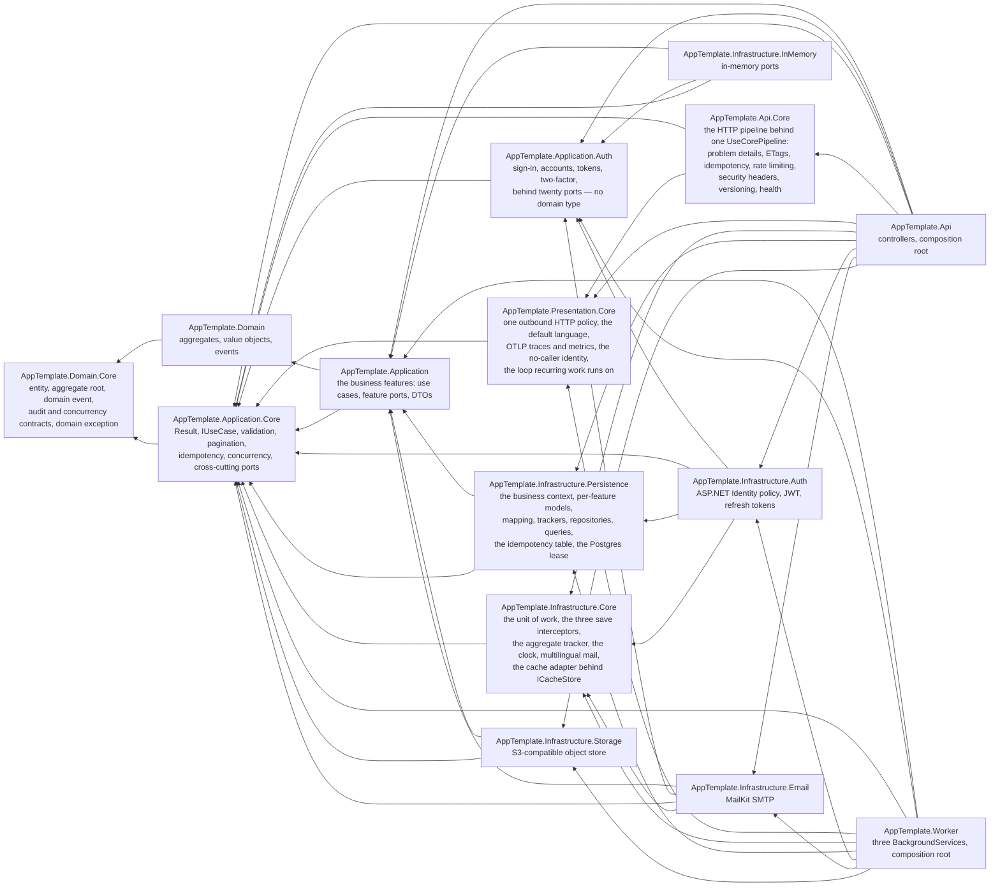

# Architecture

A Clean Architecture layout for a .NET 10 HTTP API. This document records the
decisions and, more usefully, the reasons — including the things this template
deliberately does **not** do.

The decisions this template already made, and the shape they impose, are in
[`DECISIONS.md`](DECISIONS.md) — each one held by a test where a test can hold it. This page is the
map; that document and the tests it names are the argument. Where the files themselves go is
[`PROJECT-LAYOUT.md`](PROJECT-LAYOUT.md).

**The shape**

- [The four layers and the dependency rule](#the-four-layers-and-the-dependency-rule)
- [Ports are named for business intent, not for technology](#ports-are-named-for-business-intent-not-for-technology)
- [Infrastructure is split per capability](#infrastructure-is-split-per-capability-with-no-per-technology-sub-split)
- [A second host: `AppTemplate.Worker`](#a-second-host-apptemplateworker)
- [The HTTP boundary](#the-http-boundary)

**How the pieces behave**

- [Aggregates and domain events](#aggregates-and-domain-events)
- [Errors: `Result` for expected failures, exceptions for bugs](#errors-result-for-expected-failures-exceptions-for-bugs)
- [The transaction boundary, and who owns it](#the-transaction-boundary-and-who-owns-it)
- [Two contexts, one database, five schemas](#two-contexts-one-database-five-schemas)

**What is not here**

- [No MediatR, no CQRS ceremony](#no-mediatr-no-cqrs-ceremony)
- [No generic repository](#no-generic-repository)
- [What is deliberately absent](#what-is-deliberately-absent) — read this one before deciding the
  template forgot something

## The four layers and the dependency rule

Source dependencies point inward, always. Nothing in an inner layer knows an outer
one exists.

| Layer | Project(s) | Contains | May reference |
|---|---|---|---|
| Domain | `AppTemplate.Domain.Core` | the primitives an aggregate is built from: entity, aggregate root, domain event, the audit and concurrency contracts, the domain exception, and `UserId` — who a thing belongs to | **nothing** |
| Domain | `AppTemplate.Domain` | aggregates, value objects, domain events, invariants | `AppTemplate.Domain.Core` |
| Application | `AppTemplate.Application.Core` | the mechanisms a use case is written *from*: `Result`/`Error`, the `IUseCase` marker, validation, offset and cursor pagination, idempotency, optimistic concurrency, the cross-cutting ports | `AppTemplate.Domain.Core` |
| Application | `AppTemplate.Application` | the business features' use cases, feature ports, DTOs, validators | `AppTemplate.Domain` + `AppTemplate.Application.Core` |
| Application | `AppTemplate.Application.Auth` | authentication and account administration as use cases, behind twenty ports; it names no aggregate, and the one domain type it names is `UserId` | `AppTemplate.Application.Core` |
| Infrastructure | `AppTemplate.Infrastructure.Core` | the mechanisms a module needs and no module owns: what a context saves through — the unit of work, the three interceptors, the aggregate tracker — plus the system clock, multilingual mail rendered from a module's own embedded templates, and a cache behind a port | `AppTemplate.Application.Core` |
| Infrastructure | `AppTemplate.Infrastructure.Persistence`, `.Auth`, `.Email`, `.Storage`, `.InMemory` | EF Core, PostgreSQL, ASP.NET Identity, JWT, SMTP | the application projects it needs (→ Domain) + `AppTemplate.Infrastructure.Core` |
| Presentation | `AppTemplate.Presentation.Core` | what any host needs whatever its transport: one outbound HTTP policy, the language a flow is written in, OTLP traces and metrics, the identity of a process with no caller — and no framework reference, deliberately | `AppTemplate.Application.Core` |
| Presentation | `AppTemplate.Api.Core` | the half of an HTTP host that knows no feature: the whole pipeline behind one `UseCorePipeline()` — problem details, ETags, idempotency, rate limiting, CORS, security headers, versioning, the health endpoints | `AppTemplate.Application.Core` + `AppTemplate.Presentation.Core`, plus a `FrameworkReference` on ASP.NET Core |
| Presentation | `AppTemplate.Api`, `AppTemplate.Worker` | controllers or a background service, composition root, host concerns | `AppTemplate.Api.Core` (the API only) + `AppTemplate.Presentation.Core` + the application projects it needs + the modules that host needs |



**Authentication is never carried transitively.** Nothing in `AppTemplate.Application.Core` and
nothing in `AppTemplate.Application` names `AppTemplate.Application.Auth`, so a project that needs
it declares it: the identity module, the email module (its reminder notifier resolves a user profile
to find an address), the in-memory doubles, and both hosts. `AppTemplate.Infrastructure.Auth`
declares no arrow to `AppTemplate.Application` at all — it implements twenty Auth ports and nothing
else.

`AppTemplate.Application.Core` is drawn by twelve arrows rather than reached through one, and that
is the point of it: nothing carries it transitively as a favour. Every project that names a
`Result`, an `IUseCase` or a cross-cutting port declares the reference itself, so removing a
business project or a module never silently takes the mechanisms with it.

The domain having **no packages at all** is the load-bearing constraint. It is what makes the
domain testable with no host, no database and no mocking framework, and it is the first thing to
check in review. Verified: `AppTemplate.Domain.Core.csproj` declares no `ProjectReference` and no
runtime `PackageReference` — its single `PackageReference` is an analyzer, `PrivateAssets="all"`,
so nothing of it reaches the compiled assembly — and `AppTemplate.Domain.csproj` declares the one
`ProjectReference` to it and nothing else. An architecture rule holds the first half, because a
dependency taken by the innermost project is a dependency taken by every project above it.

`AppTemplate.Domain.Core` is the primitives an aggregate is built from, written as a package and
vendored rather than published. That is what its shape is for. Its public surface is tracked in
`Src/Domain/AppTemplate.Domain.Core/PublicAPI.Shipped.txt` and
`Src/Domain/AppTemplate.Domain.Core/PublicAPI.Unshipped.txt`, so widening it is an explicit diff to
review; `CS1591` is re-enabled in that project alone, because a derived project reads those
signatures rather than the code behind them, and `dotnet pack` runs over it, which is what proves
the self-containment rather than merely asserting it. It carries no version, because a project that
needs a primitive this one lacks copies the project and tunes it. The whole point of the division
is what it leaves for a derived project to write: its own `Features/`, plus whatever its own
features come to share as business.

**Which brings up the one thing worth being precise about, because two folders share a name.**
`<Layer>.Core/Common/` is the agnostic half of a layer — `Result`, `Error`, `PageRequest`,
`SortOrder`, `IUnitOfWork`, `ICurrentUser`, `AggregateRoot<TId>`, `IDomainEvent`, `UserId`. Nothing
in it knows a feature, and nothing in it ever may; that is the whole claim of those projects.
`<Layer>/Common/` is the business-shared half, and it exists so business code is not repeated across
features: a value object three features spend, a DTO two features answer with, a policy that spans
them. The sorting test is one question — **does it know a feature?** If it names a feature, or would
have to the moment a second feature used it, it belongs in the business project's `Common/`; if it
does not and never will, it belongs one project inwards.

**Tagging is what occupies the business half, in both layers.** Two example features accept tags —
a to-do item and a stored file — which is what makes a tag business-shared rather than either
feature's own. `AppTemplate.Domain/Common/Tagging/` holds `Tag`, the normalised free-text label, and
`TagSet`, the three rules that govern a set of them: held once however many times it is sent, capped,
and replaced totally rather than merged. `AppTemplate.Application/Common/Tagging/` holds
`TagValidation`, so a caller gets one 400 naming every tag it got wrong rather than the first, and
`UsedTagsCache`, which is where the key and the lifetime of the used-tag read are decided once
instead of once per feature. Every one of those names a tag and nothing narrower, and none of them
names a feature — which is the sorting test above, answered in the direction that keeps them out of
the two `.Core` projects. `LayoutConventionTests` holds the vocabulary of both folders, checked in
both directions, and its failure message asks which of the two kinds a new folder is before naming
its words.

`AppTemplate.Application.Core` is the same shape one layer out, and it holds the application layer's
*mechanisms* rather than any of its business: `Result` and `Error`, the `IUseCase` marker every
named interface derives from, validation, offset and cursor pagination, idempotency, optimistic
concurrency, and the cross-cutting ports a host has to satisfy. It references
`AppTemplate.Domain.Core` and nothing else — never `AppTemplate.Domain`, because the two files here
that need a domain type, `IDomainEventConsumer` and `DomainGuard`, need only the primitives — so
this project knows no aggregate and cannot come to know one. It carries the same package-grade
shape for the same reasons: a tracked public surface in
`Src/Application/AppTemplate.Application.Core/PublicAPI.Shipped.txt` and
`Src/Application/AppTemplate.Application.Core/PublicAPI.Unshipped.txt`, `CS1591` re-enabled so
every public member owes a sentence to the reader who reads signatures instead of code, `dotnet
pack` over it to prove the self-containment, and no version, because a project that needs a
mechanism this one lacks copies it and tunes it. Its single use case,
`Features/Maintenance/UseCases/Commands/PurgeExpiredIdempotencyKeys/`, is the idempotency
mechanism's own housekeeping and names no business type; a host opts into it with
`AddPurgeExpiredIdempotencyKeys()`, so one that has neither a maintenance endpoint nor a
maintenance loop is not made to supply the two ports it resolves. Both purges are reachable two
ways in this template: `MaintenanceController`, for a scheduler outside the process — a Kubernetes
CronJob, a cloud scheduler — and the worker's maintenance loop, whose interval is configuration. There is deliberately no
`AddApplicationCore()` beside it: this project declares ports, results and markers, none of which
anything registers, and an umbrella call that registered nothing would read like the seam that
makes the project work.

`AppTemplate.Application.Auth` is the layer's third project, and it is a vertical rather than a
Core: authentication and account administration as use cases — sign-in, refresh-token rotation, the
password and email lifecycle, two-factor enrolment, external providers, roles and lockouts — under
`Features/Auth/{Errors,Policies,Ports,UseCases}`. It declares one project reference,
`AppTemplate.Application.Core`, and it names **no aggregate**: the identity model is not one here,
it lives behind the twenty ports in `Features/Auth/Ports/`. The one domain type it names is
`UserId`, which arrives through `ICurrentUser` — and every one of its own twenty ports takes the
raw `Guid` inside it instead, because what an account is identified by here is the subject a token
carries rather than the business's notion of an owner. That is why the unwrap is visible at each of
those calls. It has a project of its own because it
is the part of this template a derived application is most likely to replace wholesale with its own
identity provider, and that is only possible if nothing composes it on that application's behalf —
hence one call, `AddAuthApplication()`, and no arrow to it from either of the other two application
projects. It is written package-grade for the same reasons the two `.Core` projects are: a tracked
public surface in `Src/Application/AppTemplate.Application.Auth/PublicAPI.Shipped.txt` and
`Src/Application/AppTemplate.Application.Auth/PublicAPI.Unshipped.txt`, `CS1591` re-enabled,
`dotnet pack` over it, and no version.

`AppTemplate.Presentation.Core` is the presentation layer's fourth `.Core` and the outermost of
them: what any host needs whatever its transport, and nothing that names one. Five subjects, one
file each — the outbound HTTP policy installed on `IHttpClientFactory`'s defaults, the
`LocalizationOptions` naming the language a flow is written in when nobody said which to read, the
`TelemetryOptions` and the OTLP tracer and meter over it, `NoCallerCurrentUser`, the answer a
process with no request gives to "who is calling", and `PeriodicJob`, the loop a host's recurring
work is written on — see the Worker below for what that primitive does and does not decide. It
declares one project reference, `AppTemplate.Application.Core`, and it is written package-grade for the same reasons the three projects inwards are: a
tracked public surface in `Src/Presentation/AppTemplate.Presentation.Core/PublicAPI.Shipped.txt` and
`Src/Presentation/AppTemplate.Presentation.Core/PublicAPI.Unshipped.txt`, `CS1591` re-enabled so a
derived project can read the signatures instead of the code, `dotnet pack` over it, and no version,
because it is vendored and meant to be tuned where it lands.

**It carries no `FrameworkReference`, and that is why it is a project of its own rather than half of
one presentation Core.** A host with no HTTP surface — a desktop client, a CLI — gets a clock, a
culture and an outbound budget from it without inheriting ASP.NET, which is the door the split
exists to keep open; `AppTemplate.Api.Core` is where everything that does need the framework goes.
Four packages this repository uses are therefore deliberately absent here, each because its own
nuspec carries that framework reference and would pull the shared framework in through the back
door: `Scalar.AspNetCore`, `Microsoft.AspNetCore.OpenApi`,
`OpenTelemetry.Instrumentation.AspNetCore`, and `Asp.Versioning.Mvc` through its dependency
`Asp.Versioning.Http`, whose own nuspec is clean, which is what makes that one hard to see.

**One telemetry registration, and three things it takes from the host rather than deciding.** This
is the first question a reader has about a shared `AddObservability` — then how does each host get
its own spans? — and each of the three answers is forced rather than preferred.

- **The service name is the host's**, which is why the call takes an `Assembly` and not a string:
  `service.name` and `service.version` are read off it, so a rename or a version bump cannot leave a
  stale literal behind. Reading the shared project's own assembly would make both hosts announce
  themselves under one name, and two processes reporting as one is worse than either reporting
  nothing. `TelemetryOptions.ServiceName` overrides it when several deployments share a collector.
- **The diagnostics names are the host's.** A host's `ActivitySource` and `Meter` names are
  constants on classes in its own feature folders, so a shared project that listed them would have
  to reference the host that references it — a project cycle no visibility change resolves. They
  arrive instead through two callbacks, `Action<TracerProviderBuilder>` and
  `Action<MeterProviderBuilder>`, invoked before the exporter so a host can still add a processor.
- **ASP.NET Core and Npgsql instrumentation are the host's**, for the two reasons above about
  packages: the first would need the framework reference this project refuses, and the second pulls
  the PostgreSQL driver, which would put a database behind every presentation host including a
  desktop one.

So each host keeps a thin extension of its own over the shared one, and it holds exactly what only
that host can say. `AppTemplate.Api`'s `Common/Observability/ObservabilityExtensions.cs` adds the
ASP.NET Core instrumentation, `AddNpgsql()`, the `Npgsql` and `Microsoft.AspNetCore.RateLimiting`
meters, and the one request-log entry that ties a caller's `traceId` to a span.
`AppTemplate.Worker`'s `Common/Observability/WorkerObservabilityExtensions.cs` adds its three loops'
sources and meters, the persistence project's `AppTemplate.Reminders` meter, and `AddNpgsql()`. What
is shared is the resource, the sampler, the outbound-HTTP instrumentation, the runtime meters and
the exporter — every part of the registration where two hosts disagreeing would be a bug rather
than a difference.

**Localisation binds in one place and is applied in two**, on the same principle. The shared
`AddLocalizationOptions()` binds and validates the section and stops there; reading the bound value
into `CurrentLanguage.Default` is left to each host, because *when* that happens is a host's own
question. A host with a request pipeline does it as the pipeline is built, so the ambient default is
in place before the first request; a host with only background work does it once the container
exists and before the first loop runs. Doing it in the shared call would pick one of those for both.

Two rules that a compiler cannot state on its own, so state them here:

- **Modules reference `Persistence`, never the reverse.** `Persistence` owns the
  mechanics of saving; it must not know which capabilities exist.
- **Modules do not reference each other.** Anything two modules both need belongs in
  Application (as a port), in `AppTemplate.Infrastructure.Core` (as an agnostic mechanism), or in
  Persistence (as mechanics). `InfrastructureModules_ReferenceOnlyPersistenceHorizontally` is the
  rule, and it permits exactly those two horizontal edges — `Persistence`, and the layer's own
  package-grade half — while asserting that both are really taken, so neither permission can
  quietly become a hole nothing uses.

Direction is enforced by the project graph, and is worth an architecture test —
`NetArchTest.Rules` is pinned in `Directory.Packages.props` for exactly that — so a
casual `using` cannot quietly invert it.

## Ports are named for business intent, not for technology

A port is an interface **implemented in Infrastructure**, and its name says what the
caller needs, not what supplies it — but the two families of port are not declared in
the same layer. A **repository** — an aggregate loaded, mutated through its own
behaviour, and staged for a commit someone else owns — is declared in
**`AppTemplate.Domain`**, under `Features/<Feature>/Repositories/`, because its
signature names only domain types. **Every other port** — a read projected to DTOs, or
a platform capability with no aggregate behind it — is declared in the application layer, and which
of its three projects declares one follows how many features need it. A port **one feature** reaches
for is declared in **`AppTemplate.Application`**, under `Features/<Feature>/Ports/<Port>/` — or in
**`AppTemplate.Application.Auth`**, under `Features/Auth/Ports/<Port>/`, when that one feature is
authentication. A **cross-cutting** one, that any feature may reach for, is declared in
**`AppTemplate.Application.Core`** — in `Common/Ports/`, or beside its own subject when it has one,
which is why `IIdempotencyStore` sits in `Common/Idempotency/` with the key, the claim and the
status it speaks in. See the section above for why the
split runs there rather than putting every port in one layer:

| Port | Declared in | Implementation (Infrastructure) |
|---|---|---|
| `ITodoListRepository`, `IReminderRepository` | `AppTemplate.Domain` | EF Core repositories over `AppDbContext` |
| `ITodoListQueries`, `IReminderTargetQueries` | `AppTemplate.Application` | EF Core projections to DTOs |
| `IUnitOfWork` | `AppTemplate.Application.Core` | one `SaveChangesAsync` on `AppDbContext` |
| `IEmailSender` | `AppTemplate.Application.Core` | `MailKitEmailSender` |
| `ICurrentUser` | `AppTemplate.Application.Core` | `CurrentUser`, reading `HttpContext` claims |
| `IDateTimeProvider` | `AppTemplate.Application.Core` | `SystemDateTimeProvider` |
| `ILeaderLease` | `AppTemplate.Application.Core` | `PostgresLeaderLease`, a session-level advisory lock |
| `IIdempotencyStore` | `AppTemplate.Application.Core` | `IdempotencyStore`, the claim/complete/release state machine over one table |
| `ICacheStore` | `AppTemplate.Application.Core` | `HybridCacheStore`, in process until a deployment registers a distributed second level |
| `IUserAccountsService` | `AppTemplate.Application.Auth` | `UserManager` / `SignInManager` wrapper |
| `IEmailConfirmationTokensService` | `AppTemplate.Application.Auth` | ASP.NET Identity's default token provider |
| `IAccessTokenIssuer` | `AppTemplate.Application.Auth` | signed JWT over the account's current claims |
| `IExternalIdentityVerifier` | `AppTemplate.Application.Auth` | an `id_token` checked against a provider's JWKS |
| `IExternalLoginsService` | `AppTemplate.Application.Auth` | the `(provider, subject)` link, over ASP.NET Identity |
| `IRefreshTokenGrantsService` | `AppTemplate.Application.Auth` | opaque rotating grants over `IRefreshTokenTable` |
| `IConfirmationEmailFactory` | `AppTemplate.Application.Auth` | HTML template plus the confirmation URL |
| `IUserProfilesService` | `AppTemplate.Application.Auth` | `UserProfilesService`, over `UserManager` — the address a due reminder is rung at |

There is no `IEfCoreRepository`, no `ISmtpClient`, no `IHttpContextWrapper`. The
point of the seam is that the application layer can be read, and tested, without
knowing that EF Core, MailKit or ASP.NET Identity exist. A port named after its
implementation has already given that away.

The authentication ports are the interesting ones. There are twenty of them, one per
capability, rather than one `IAuthService`, and the split is what keeps the
*sequencing* in Application: `RegisterUseCase` creates the account, then mints a
confirmation token, then composes and sends the mail through `IEmailSender`, and
decides that a delivery failure is a success carrying `confirmationEmailSent: false`.
`RefreshAccessTokenUseCase` rotates the presented grant, then revalidates the
account, then revokes the whole family if it may no longer sign in. Each port is one
capability an adapter can satisfy on its own,
and the ASP.NET Identity types (`AppUser`, `UserManager<>`) never appear in
Application. An architecture test asserts that no port grows wide enough to take the
sequencing back. Because those twenty ports are all `AppTemplate.Application.Auth` speaks in, that
project names no aggregate: an account here is what its ports say about it.

## Infrastructure is split per capability, with no per-technology sub-split

Each capability gets one project, one DI extension method, and — where it needs
storage — one DbContext over the schemas it owns:

| Module | Registers | Storage |
|---|---|---|
| `AppTemplate.Infrastructure.Persistence` | `AppDbContext`, `IUnitOfWork`, `ILeaderLease`, the aggregate repositories and read-side ports, the idempotency store | `AppDbContext` → `todo`, `reminders`, `files`, `platform` |
| `AppTemplate.Infrastructure.Auth` | the authentication ports, ASP.NET Identity, JWT bearer, refresh-token rotation, `IRefreshTokenTable`, `IIdentitySeeder` | `AuthDbContext` → `identity` |
| `AppTemplate.Infrastructure.Email` | `IEmailSender`, `IReminderNotifier`, email options | — |
| `AppTemplate.Infrastructure.Storage` | `IFileContentStore`, `IFileContentInventory`, storage options | one S3-compatible bucket |
| `AppTemplate.Infrastructure.InMemory` | in-memory port implementations for tests and demos | — |

**`AppTemplate.Infrastructure.Core` is not in that table, because it is not a capability.** It is
the layer's agnostic half: the mechanisms a module needs and no module owns. A module may not
reference a sibling, so without it two modules needing one mechanism have nowhere to put it and each
keeps a copy. Multilingual mail rendering is the case that pays for the project: the identity module
and the email module both send mail, so each would otherwise carry its own renderer.

It holds three subjects. **What a context saves through** — `EfUnitOfWork` over whichever
`DbContext` a module owns, the three interceptors that run in order (aggregates flushed onto their
rows, rows stamped, the events that flush raised drained), and the `AggregateTracker` base every
feature's tracker derives from. **The system clock**, behind `IDateTimeProvider`. And the mail
engine, `EmailTemplate`, which
renders a module's *own* embedded resources and reads the subject out of the template so a caller
never states it twice; and `HybridCacheStore`, the one adapter behind `ICacheStore`. It registers
one thing, `AddCacheStore()`, because the template engine is a type a module news up rather than
resolves. Two calls compose the saving half: `AddCoreSaving<TContext>()` registers the mechanisms
for one context, and `AddCoreSavingInterceptors()` attaches the three interceptors where that
context's options are built. The context is a type argument rather than something resolved, because
a deployment may own more than one and nothing registers the base `DbContext` for a container to
pick from.

**Every adapter of an application port here stays `internal`, and that is what the calls are for.**
`EfUnitOfWork`, `SystemDateTimeProvider` and `HybridCacheStore` are composed by making the call,
never by naming the type, which is what
`AdapterVisibilityTests.Adapters_ImplementingAnApplicationPort_AreInternalToTheirModule` holds — and
what lets two modules share one mechanism without either owning it. What is public is what a module
cannot delegate: the `AggregateTracker` it derives from, the `StoredStamps` its mapper calls, the
`IAuditActor` its host answers, and the interceptors it attaches to its own context. Like the other
five package-grade projects it carries a tracked public surface, `CS1591` re-enabled, `dotnet pack`
over it, and no version.

Its `Common/` is held to the rule below by construction rather than by that rule: an SDK project
may reference only SDK projects, so it cannot name `AppTemplate.Application` or
`AppTemplate.Domain` at all, and a type there could not name a feature if it tried.

**How many features a module serves is not what distinguishes it.** Two modules serve
several: `Persistence` carries `Auth`, `TodoLists`, `Reminders` and `Files`, and
`InMemory` carries `Auth`, `Files` and `Reminders` — five ports under those three feature
folders, plus `IEmailSender` and `IDateTimeProvider` under its own `Common/`, and one opt-in
extension method per feature (`AddInMemoryExternalIdentities`,
`AddInMemoryReminderNotifications`, `AddInMemoryFileContent`) on top of `AddInMemoryModule`
itself. `Identity` serves `Auth` alone, `Email` serves the two ports that send mail, and
`Storage` serves `Files` alone. What is uniform is the *shape*: every module is partitioned
as `Common/` (the mechanisms) plus `Features/<Feature>/` (models, configurations, mapping,
tracking, repositories, queries, and — for row access to one table rather than an aggregate,
such as `IRefreshTokenTable` — stores), whether it serves one feature or four, because a
reader who has learned one module should not have to learn a second filing system for the
next.

That shape is held by two tests, over all five modules that have a `Common/`.
`ModuleDependencyTests.ThePersistenceMechanisms_KnowNoFeature` takes the types under
`AppTemplate.Infrastructure.Persistence.Common` and `EveryModuleCommon_KnowsNoFeature` takes
the other four, and both assert that nothing there depends on `AppTemplate.Domain.Features`,
`AppTemplate.Infrastructure.Persistence.Features` or `AppTemplate.Application.Features`.
`AppDbContext` is excluded by name because it applies every feature's configuration and is
therefore the model's composition root — and a second test asserts that it really does name a
feature, so the exclusion stays a decision rather than a hole.

There is one other exclusion, in the identity module, and it is written as a list with a
reason beside it rather than as a condition. `IAppUserDirectory` and its adapter name
`AppUser`, the ASP.NET Identity row the persistence module maps. That is the permitted
direction — the rule above forbids only the reverse — and `AppUser` is a stored account rather
than a business entity, which is why the directory is shared machinery rather than a feature
adapter in disguise. Adding a second name to that list is a line somebody has to justify in
review.

The forbidden list runs to four namespaces rather than one because an adapter can belong to a
feature in its name, its counters and its prose while depending on none of that feature's
types, and a rule that reads only dependencies cannot see it. An adapter that counts one
feature therefore lives with that feature, as
`Features/Reminders/Observability/ReminderDiagnostics.cs` does. See below for why one context
rather than two, and why EF maps rows rather than aggregates.

**One DI module per project, and the application layer is composed a feature at a time.** Both
hosts' composition roots are the same ten lines, in the same order — `AddTodoLists()`,
`AddReminders()`, `AddFiles()`, then `AddAuthApplication()`, then
`AddPurgeExpiredIdempotencyKeys()`, then `AddCacheStore()`, then
`AddPersistenceModule(builder.Configuration)`, `AddAuthModule`, `AddEmailModule` and
`AddStorageModule`. The first six take no argument, because nothing in the application layer binds a
configuration section of its own and the cache decides its lifetimes at each call site; the four
modules each take one. Adding a capability adds one line there and touches nothing else; removing
one deletes a project and a line.

Three further lines are common to both hosts and are not among the nine, because they compose host
concerns rather than capabilities: `AddOutboundHttp()`, the localisation binding — reached through
`AddRequestLanguage()` in `AppTemplate.Api`, which adds the request-header middleware around it, and
directly as `AddLocalizationOptions()` in `AppTemplate.Worker` — and each host's own thin
observability extension over the shared `AddObservability`. All three come from
`AppTemplate.Presentation.Core`.

**There is deliberately no call that adds the whole layer.** That is what makes a feature
removable: deleting its folder and its one line here is the whole operation, and nothing else claims
to have registered it. One entry point scanning a layer's assembly would put every port every
feature declares into every host's graph, which under `ValidateOnBuild` makes each of them mandatory
in every host — which is precisely what a module being *optional* rules out.
`LayerDependencyTests.TheApplicationLayer_KnowsNothingOfAuthentication` is what turns that from a
claim into an assertion, and it asserts the half that is true: read off the assembly manifests,
neither `AppTemplate.Application` nor `AppTemplate.Application.Core` names anything in
`AppTemplate.Application.Auth`.

What does **not** hold is the larger claim that a container builds without authentication. In this
template it does not, and
`ContainerCompositionTests.RemovingAuthentication_IsHeldUpByOneInfrastructureCoupling_NotByTheApplicationLayer`
pins the one reason so it cannot quietly stop being the reason: `IReminderNotifier`, which the
reminder feature's own use case takes, has its single adapter in the email module — whose reminder
notifier in turn resolves `IUserProfilesService`, an authentication port, to find the address a due
reminder is rung at. That is **the single business-to-auth door**, it is deliberate, and the port is
the joint that lets the adapter become a call across a process without anything business-side
changing.

`IIdentitySeeder` is not a second reason. The seeder belongs to the authentication module, so
removing that module takes it away, and the same test asserts that absence rather than trusting it.
And `AddReminders()` is not independent of `AddTodoLists()`: scheduling a reminder reaches into the
to-do list's read port, the only ownership check made before a reminder is created. The example
features are not four symmetric modules, and saying so is cheaper than a start-up failure that does
not explain itself.

`AddInMemoryModule` is the one module no host composes: it is registered by tests, over
whichever real module they are replacing.

**Why there is deliberately no `.Core` / `.<Technology>` sub-split.** The tempting
next step is `AppTemplate.Infrastructure.Persistence.Core` + `.PostgreSql`, or
`AppTemplate.Infrastructure.Email.Core` + `.MailKit`. This template does not do that, because:

- There is **one database** (PostgreSQL) and **one SMTP client** (MailKit). An
  abstraction with exactly one implementation is not an abstraction, it is a second
  file to keep in sync.
- The seam that actually buys portability already exists, one layer in: the
  Application-side port. `IEmailSender` is what a second transport would implement.
  Splitting *inside* Infrastructure adds an interface below the interface that matters.
- The cost is immediate and permanent: twice the projects, twice the DI wiring, and a
  reader who has to open two files to answer "what does this do".

If a second database engine ever genuinely arrives, the split is mechanical then, with
the real second implementation in hand to shape it. Doing it speculatively means
guessing at that shape.

## A second host: `AppTemplate.Worker`

`AppTemplate.Worker` runs three `BackgroundService`s. `MaintenanceBackgroundService`
purges expired idempotency keys and expired refresh-token grants on a timer, through
the exact same `IPurgeExpiredIdempotencyKeysUseCase` and
`IPurgeExpiredRefreshTokensUseCase` that `AppTemplate.Api`'s `MaintenanceController`
exposes over HTTP. `ReminderBackgroundService` runs `IFireDueRemindersUseCase` on its
own timer — the only caller that use case ever has, since firing a reminder must never
run behind a request. `FileBackgroundService` runs three passes on three separate
timers, because their costs are three orders of magnitude apart:
`IPurgeAbandonedRegistrationsUseCase` (one indexed query and a bounded batch of deletes),
`IReclaimOrphanedContentUseCase` (a walk of the whole object store), and
`IInspectDepositedFilesUseCase`, which is not a sweep at all — it is the only thing that
moves a file from `deposited` to `available`, so its interval is a latency a user feels
rather than a background cost.

**All three are written on one loop primitive, and it is a primitive rather than a base class.**
`PeriodicJob.RunAsync`, in `AppTemplate.Presentation.Core/Common/Jobs/`, runs one iteration
immediately, then one per interval, and returns when the stopping token is cancelled — whether the
stop arrives while waiting for the next tick or from inside an iteration, so a shutdown log after
the call always runs. Ticks that elapse during a slow iteration coalesce into one, so an iteration
never overlaps itself. A service composes one instance or three, which is what lets
`FileBackgroundService` run three passes on three intervals without three classes; a base class
would have given each loop one interval and made that shape the exception.

What it deliberately does not decide is everything a base class would have taken: each service keeps
its own start-up log, its own span and counter names, its own scope granularity, and its own
treatment of a pass switched off. Exclusivity between two processes is not its business either —
that belongs to the operation, which is why `ILeaderLease` is taken inside the use cases that need
it and by no loop here.

The Worker proves that the Application layer is composable by a non-HTTP host — it
references neither `AppTemplate.Api` nor `AppTemplate.Domain` (verified in
`Src/Presentation/AppTemplate.Worker/AppTemplate.Worker.csproj`), and it calls real use
cases without shortcutting to infrastructure
(`Features/Maintenance/MaintenanceBackgroundService.cs`,
`Features/Reminders/ReminderBackgroundService.cs`,
`Features/Files/FileBackgroundService.cs`). It shows, in the same stroke, what
that costs: a host has to answer, one way or another, for the ports that describe its
calling context. Its `ICurrentUser` is `NoCallerCurrentUser`, which
`AddNoCallerIdentity()` registers scoped out of `AppTemplate.Presentation.Core` — a
question this host is not the only one to face, which is why the answer is a subject in
the shared project rather than a file here. It **throws** on `UserId`, because there is
no caller to name: no HTTP request and no principal behind it, so returning `null` as if
it were merely an anonymous caller would let a use case that needs an owner proceed as
though one existed. `IFireDueRemindersUseCase` takes that constraint furthest: it must
not read `ICurrentUser` at all, since it acts on every user's due reminders in one pass
rather than one caller's. What genuinely stays in the host is
`Common/Security/BackgroundAuditActor.cs`, which names a persistence contract and so
cannot move into a project written as a package.

A future rich client is not exempt from that cost either: it would still have to write
a real `ICurrentUser` naming an actual caller, which is a port implementation, not
just module composition.

## No MediatR, no CQRS ceremony

A use case is a plain class with a constructor and one method, registered in DI and
injected into a controller:

```
Src/Application/AppTemplate.Application/Features/TodoLists/UseCases/Commands/CreateTodoList/CreateTodoListUseCase.cs
Src/Application/AppTemplate.Application/Features/TodoLists/UseCases/Commands/AddTodoItem/AddTodoItemUseCase.cs
```

MediatR would add a `Command` type, a `Handler` type, an `IRequest<>` marker and a
runtime dispatch step to reach exactly the same method. What you get back is pipeline
behaviours — and validation, logging and transactions are all available without them:
FluentValidation runs in the use case, logging is `ILogger`, and the transaction
boundary is `IUnitOfWork`.

The real cost of the indirection is navigability: `F12` on a use case goes to the
code, not to a marker interface, and the call graph is a call graph. The compiler
checks the wiring instead of a runtime registry.

This is not an argument against MediatR in general. It is an argument that a template
should not pay for it before there is a pipeline to put in it. Adding it later is
mechanical; removing it once every handler assumes it is not. See
[`DECISIONS.md`](DECISIONS.md), which also names the package the architecture tests forbid.

There is a read/write split, but it is the useful part of CQRS without the machinery —
two ports rather than two stacks:

| Port | Purpose |
|---|---|
| `ITodoListRepository`, `IReminderRepository` | Write side. Load and stage whole aggregates. |
| `ITodoListQueries`, `IReminderTargetQueries` | Read side. Return DTOs projected in SQL, no aggregate materialisation. |

Reads do not need invariants enforced, and loading a full aggregate to render a list
view is pure waste. Both read methods take the owner's id as a parameter, so
"only the caller's own rows" is part of the port's signature rather than something a
future implementation might forget.

## No generic repository

There is no `IRepository<T>`. `ITodoListRepository` has exactly three members —
`GetAsync`, `Add`, `Remove` — because a generic repository can only offer operations
that make sense for every entity, which in practice means CRUD, and CRUD is exactly
what an aggregate is supposed to hide.

Two concrete defects a `BaseRepository<T>` carries, and that this shape exists to refuse:

1. **It leaks `IQueryable` to its callers.** Query composition lands in the application
   layer, so EF Core's translation rules — and every change to them — become an
   application-layer concern.
2. **It calls `SaveChangesAsync` inside every method.** A use case touching two things gets
   two transactions, with no way to roll back the first.

Repository methods here only *stage* work; the commit belongs to `IUnitOfWork` and to the use
case that calls it. See [`DECISIONS.md`](DECISIONS.md) for the four words that name the four ways
this template reaches storage, and which of them a contract is allowed to be.

## Aggregates and domain events

`AggregateRoot<TId>`, from `AppTemplate.Domain.Core`, is the consistency and
transactional boundary. An aggregate whose row carries audit columns and an optimistic-concurrency
token derives from `AuditableAggregateRoot<TId>` instead, which holds those five values and
implements `IAuditable` and `IVersioned` explicitly — so the store writes them and application code
holding the aggregate cannot, and a new aggregate declares none of it. **Only aggregate roots get a repository**; entities inside an aggregate are reached through their root.
`AppDbContext` exposes an `internal DbSet<TodoListRecord>` for that reason — an
exposed `DbSet<TodoItemRecord>` would hand every caller a way around the invariants
the root enforces. The HTTP surface mirrors it exactly: `/api/v1/todo-lists/{id}/items/{itemId}`
means there is no route that can reach an item without naming its list.

`ITodoListRepository.GetAsync` loads the *complete* aggregate — list, items, tags.
That is a correctness requirement, not an optimisation preference: invariants like
unique item titles and the 500-item cap can only be checked against all the items.
The cap exists because "a write always loads the whole aggregate" makes aggregate size
a hard bound on the cost of every single command.

`TodoList.Version` is an optimistic concurrency token mapped to PostgreSQL's `xmin`
system column, and it lives **on the root only** — the root is the consistency
boundary, so a concurrent edit to any item is a conflict on the list.

Events are raised on the root (`RaiseDomainEvent`) and buffered, then collected and
dispatched by `DomainEventDispatchSaveChangesInterceptor` when the transaction
commits. Two consequences worth stating:

- An event is never observed for a transaction that rolled back.
- Handlers run **in-process and in the same transaction**. This is not a message bus.
  A handler that must reach another system should write to an outbox, not do the I/O
  inline.

Cross-cutting save behaviour lives in `ISaveChangesInterceptor` implementations
(`AuditingSaveChangesInterceptor`, `DomainEventDispatchSaveChangesInterceptor`) rather
than a `SaveChangesAsync` override. Interceptors are separately testable, individually
replaceable, and — unlike the override — also apply to the synchronous overload.

Time is a parameter, not an ambient dependency: `TodoList.Create(ownerId, name, now)`
takes `now`, so the aggregate's behaviour is reproducible in a test without freezing a
clock.

## Errors: `Result` for expected failures, exceptions for bugs

| Situation | Mechanism |
|---|---|
| Not found, conflict, validation failure, unauthorised, rate-limited | `Result` / `Result<T>` carrying an `Error` |
| A domain invariant was violated | `throw new DomainException(...)` |
| Programming error, infrastructure failure | let it propagate |

The rule: **an expected outcome is a value; only a bug is an exception.**

"Not found" is not exceptional — it is one of two normal answers to a lookup, and
modelling it as a `Result` makes the failure modes visible in the use case's signature
instead of discoverable by reading its body. Throwing `InvalidOperationException` for
"not found" instead would surface a routine answer as an unhandled fault, and leak the
message to clients as an HTTP 500.

`Error` carries a stable dotted `Code` (`todoList.notFound`,
`auth.login.invalidCredentials`) and an `ErrorType` that says how the transport should
render it. `ErrorMapping` is the single place where that becomes an HTTP status and a
ProblemDetails body, so a given situation always produces the same status on every
endpoint. Codes are grouped in one file per vertical — `TodoListErrors`, `AuthErrors` —
which is what stops the same situation from acquiring two codes; a code no single
vertical owns, such as the invariant one below, lives in `CommonErrors` instead.

`DomainException` is genuinely exceptional: it means a caller drove an aggregate into
a state the model forbids. `GlobalExceptionHandler` maps it to 400 with a fixed
message and never echoes the invariant text; anything else becomes a 500 with a
`traceId` and no exception detail at all. One nuance: `CommonErrors.InvariantViolated`
exists so a use case that *expects* an invariant to refuse can run the call through
`DomainGuard`, which catches `DomainException` for it and turns it into a 409
`Result` — the domain message is written by us, in terms of the user's own data, so
there is no second copy of the rule in Application that could drift from the first.

Costs, honestly: every use case signature carries `Result`, callers must check
`IsSuccess`, and `Result` is a class, so there is an allocation per call. Both are
worth it for making the failure set explicit at the boundary. See
[`CONVENTIONS.md`](CONVENTIONS.md) for which failures take a `Result` and which take an exception.

## The transaction boundary, and who owns it

**The use case owns it.** Nothing else may commit.

- Repositories *stage*: `Add`, `Remove`, and mutations on a loaded aggregate.
- `IUnitOfWork.SaveChangesAsync()` is the only commit, and only a use case calls it.
- For a single `AppDbContext` that is exactly one `SaveChangesAsync`, which EF wraps
  in a transaction of its own: everything the use case staged either lands or none of
  it does.
- Domain events dispatch inside that same save, via the interceptor.

The point of the indirection is not the one line of code in `UnitOfWork`. It is that a
use case cannot commit by accident: it depends on an interface with one method instead
of on a repository that saved inside every write.

**Where the boundary reaches now.** With one context, `RefreshTokenGrants` commits
through `IUnitOfWork` like everything else, so a refresh-token rotation and a domain
write *can* share a transaction — which was impossible while the two contexts existed.

**Where it still does not reach.** ASP.NET Identity's own stores call
`SaveChangesAsync` themselves: `UserManager.CreateAsync` commits before it returns, and
that is framework behaviour rather than a choice. Registration is therefore explicitly
not atomic — the account is committed before the confirmation email is handed to the
relay, `RegisterResponse` reports `ConfirmationEmailSent = false` when delivery fails,
and a resend endpoint exists so the user is not stuck. Verified by request.

**Where a lost update becomes an HTTP response.** `EfUnitOfWork` is the one place a
commit happens, so it is where EF's `DbUpdateConcurrencyException` is translated into
`ConcurrencyConflictException` — an Application-layer type with no EF in it. The API
answers that as `409` with the stable code `concurrency.conflict` in an
`application/problem+json` body. Nothing is retried: re-applying a decision made against
state that no longer exists is the lost update the token exists to prevent.

## Two contexts, one database, five schemas

| Schema | Tables |
|---|---|
| `todo` | `TodoLists`, `TodoItems`, `TodoItemTags` |
| `identity` | `User`, `Role`, `UserRoles`, `UserClaims`, `UserLogins`, `RoleClaims`, `UserTokens`, `RefreshTokens`, `DataProtectionKeys` |
| `reminders` | `Reminders` |
| `files` | `StoredFiles` |
| `platform` | `IdempotencyKeys` |

Four of those name a feature; `platform` is the one that does not, and it exists precisely so
that a table belonging to no feature — the idempotency key store is the first of them — is not
filed under a feature that would be a lie. The business half's `__EFMigrationsHistory` sits in
`public`, outside every module schema, for the same reason taken one step further: it describes the
database rather than anything in it. The authentication half's carries the same name inside
`identity`, beside the tables it records, so the two histories on this database are told apart by
the same thing that tells their tables apart. Each context declares the schema names it owns as
constants — `TodoSchema`, `RemindersSchema`, `FilesSchema`, `PlatformSchema` and
`MigrationsHistorySchema` on `AppDbContext`, `IdentitySchema` on `AuthDbContext` — so a schema name
is spelled once.

There are two contexts, and the line between them is what the halves of this system are.
`AppDbContext`, in `AppTemplate.Infrastructure.Persistence`, maps the to-do list, reminder and file
features' rows and the idempotency table. `AuthDbContext`, in `AppTemplate.Infrastructure.Auth`,
derives from `IdentityDbContext<AppUser, AppRole, Guid>` and maps everything in `identity`. Every
table names its own schema in its own `IEntityTypeConfiguration`, so no default schema is set and a
mapping cannot drift into the wrong schema by omission.

It resolves from the **single `ConnectionStrings:Default`**, and one key is what one database is
owed: a second key pointing at the same server is a second thing to keep in step, free to be
configured inconsistently, and nothing notices until runtime.

**Why two contexts and not one.** Authentication is the part of this template a derived project is
most likely to replace wholesale, and a module cannot be replaced while its tables are mapped by
somebody else's model. Each context has its own migrations history — the business half's in `public`,
the authentication half's in `identity`, beside the tables it records — so each half migrates without
the other's permission and removing one is deleting a project rather than editing a shared model.

**What that costs, stated rather than discovered.** Two contexts are two units of work, so no
transaction spans an identity write and a business write. Nothing needs one: no code path commits
both, which was measured before the split rather than hoped for. And two histories can disagree
about what has been applied — the API's Development bootstrap applies both in one pass to keep that
window as short as one process can make it, and a deployment applies each as its own explicit step.

**The commit boundary is typed, because the untyped one cannot tell them apart.** A container
registers `IUnitOfWork` once; a module whose writes were staged on the second context would have
them committed by the first, and `SaveChangesAsync` on a context with nothing tracked succeeds
reporting zero rows. So a module that owns a context takes
`IContextUnitOfWork<TContext>`, and the unnamed port a use case takes is registered by the module
that owns the business context. That is the one failure this split could have introduced silently,
and it is designed out rather than tested for.

**No foreign key crosses the line, and two things keep it that way.** The risk is a domain entity
acquiring a navigation property to `AppUser` — a foreign key from the business to the identity
provider, which is what makes swapping the provider later impossible. Separate contexts make it
impossible to declare: EF cannot relate entities in two models. And it could not happen inside one
either, because EF does not map the domain entities at all — `TodoListRecord.OwnerId` is a bare
`Guid` column with no navigation, and `TodoList.OwnerId` is a `UserId`, an opaque owner in a project
with no reference to EF Core or to ASP.NET Identity. The architecture tests assert both.

**Why one database.** Two databases would mean two connection strings, two backup
schedules, and no transaction spanning both. Separate *schemas* give the isolation that
matters — no table-name collisions, grantable separately — at none of that cost.

Each context has a design-time factory — `AppDbContextFactory` and `AuthDbContextFactory` — reading
`ConnectionStrings__Default` from the environment with a visible localhost fallback, so `dotnet ef`
works on either without booting a host. Each names its own history table there as well as at
runtime: configured in only one of the two places, the tool would record a migration where the
runtime does not look, which with two histories on one database means the other half's.

**One connection string means one pool.** Npgsql pools per connection string, so both contexts
building the identical string share a single pool bounded by `Database:MaxPoolSize`. That is why
`DatabaseOptions` lives in `AppTemplate.Infrastructure.Core` and both modules bind the same section
into it: two modules deriving the bound separately would give a deployment two pools of that size
instead of one.

### Why a separate row type at all

Mapping the domain aggregate directly is less code. The cost it hides is that the storage shape
then dictates the model: a column has to become a property, a collection has to be something EF can
materialise, and every mapping decision — a value object as a complex type, a derived property
ignored, a backing field written through — is a constraint the domain carries for the database's
benefit. Separating them means the aggregate answers only to its own rules and the row only to the
schema, and the price is paid in one place: the mapper, plus the flush pipeline that keeps EF's
change tracker useful without it ever seeing the aggregate.

## The HTTP boundary

`AppTemplate.Api` is thin on purpose. A controller binds, calls one use case, and maps:

- `ApiControllerBase` turns a `Result` into `200` / `201 + Location` / `204`, or hands
  the `Error` to `ErrorMapping`. No business logic, no `try`/`catch`, no hand-rolled
  error shapes.
- **Authorisation is default-deny.** `Program.cs` installs an authorization fallback
  policy requiring an authenticated user, so an endpoint is protected unless it opts
  out. Ten of `AuthController`'s eighteen actions and the two health endpoints do —
  and, in Development only, so do the two OpenAPI endpoints. One consequence: because
  the fallback policy also applies when no endpoint matched, an unknown route answers
  401 to an anonymous caller rather than 404.
- **A provider name is a field, never a route segment.** `POST /auth/external` takes the provider
  in its body. Routing is the one layer that answers before any code does, so a provider in the path
  makes "is this provider configured?" a question the router can be made to answer — by a
  constraint, a catch-all that does not match, or a second route added later — and an unknown
  provider becomes a 404 where a configured one is a 401. One route and one handler disclose
  nothing. It also keeps `SignInWithExternalProviderCommandValidator`'s presence rule reachable: a
  route segment can never bind empty, so a missing provider would be a 404 instead of the 400 every
  other required field produces.
- **No HTTPS redirection.** TLS terminates upstream and the container listens on plain
  8080; redirection would 307 the orchestrator's health probe.
- **Liveness has no dependency check**; readiness checks the database and whether the host
  has begun shutting down. An orchestrator must not restart a healthy process because the
  database blinked, nor kill one that is draining correctly.
- **Rate limiting** is partitioned by client IP: 10/minute on auth, 300/minute
  globally, 429 with `Retry-After`. Both counters are per instance, so the limit a caller
  meets is multiplied by the replica count — see `docs/CONFIGURATION.md`. The health
  endpoints sit outside the limiter, so a traffic spike can never make a probe fail and
  have the orchestrator restart a process that is merely busy. Behind a proxy the partition
  key is only correct once `ReverseProxy:Enabled` is turned on — see below; the mechanism is
  shipped, the trust list is what your topology has to supply.
- **A wire contract is this layer's own type, never an application or port type reused.** Every
  feature projects onto its own records in `Contracts/`, by hand, through one `Mapping/` class.
  Three of those projections are what the boundary is for, and the rest look like ceremony because
  field-for-field is the common case: `ReminderResponseMapping` answers with a string status so no
  client depends on the declaration order of a domain enum; `RegisterResponse` withholds the user id
  its application outcome carries, because nothing downstream of sign-up addresses the account by
  id; and `StoredFileResponseMapping` republishes the content store's upload grant under a contract
  of this layer, so a field added to `IssuedUploadGrant` by the next object-store adapter is not
  published to every client by that edit alone. None of the three survives a contract that *is* the
  application type.
- **Structured JSON logs.** `AddJsonConsole` replaces the default unstructured
  formatter, so production logs are queryable without taking on a third-party logging
  dependency the template would then have to maintain.

## What is deliberately absent

| Not here | Why |
|---|---|
| Soft delete | The old model had an `IsDeleted` column no code set, no query filtered on and no delete used. Done properly it means a global query filter on every read, an interceptor rewriting Deleted→Modified, filters replicated into every projection, and unique constraints excluding dead rows. A list is the unit of deletion; deletes are real and cascade. |
| `AutoMapper` | Projections are explicit. A mapping the compiler cannot check is a runtime failure waiting for a rename. |
| A service layer above use cases | The use case *is* the application service. |
| An abstraction over `DbContext` | `DbContext` is already a unit of work and a set of repositories. `IUnitOfWork` exists to own the *commit boundary*, not to hide EF Core. |
| Swashbuckle | Replaced by the built-in `Microsoft.AspNetCore.OpenApi` plus Scalar for the UI (development only). |
| A refresh-token cookie | The refresh token is returned in the response body: opaque, rotated on every presentation, and stored only as a SHA-256 hash. |
| Migrations at startup in production | Development only; a deployment applies them as an explicit step. |
| An outbox | Domain-event handlers run in-process, after the commit, so delivery is at-most-once and there is no reliable integration with another system. What stands in for one here is a rule rather than a mechanism: **every consumer re-derives its own precondition**, so none of them is load-bearing. Deleting a stored file's bytes is a fast path over a sweep that lists the store and removes what no row names; cancelling a reminder on completion is re-checked by the firing pass itself, which its own documentation says is what keeps firing correct whether or not that delivery happened. A handler that cannot be written that way belongs behind an outbox — do not do the I/O inline. |
| Permissions, policies, or tenants | Authorisation is one role. `AuthorizationPolicies.Administrator` requires the `Admin` role and is the only policy beside the default-deny fallback, and nothing anywhere carries a tenant. Policies extend where that one is registered, in `AppTemplate.Api/Common/Security/AuthorizationPolicies.cs`, or through ASP.NET Core's own `IAuthorizationPolicyProvider` for a permission set computed rather than listed. A tenant is not a policy, though: every owned aggregate holds a bare `Guid OwnerId`, and a tenant would be a second column beside it on every table and in every ownership check. |
| Machine-to-machine authentication | No API keys and no client-credentials flow: every token this template mints belongs to a person who signed in. The extension point is a second authentication scheme beside the bearer one `AddAuthModule` registers, and `IAccessTokenIssuer` is the port a client-credentials grant would mint through. |
| A message bus or queue port | The Worker polls the database on a timer, and the operations that must not run twice at once take `ILeaderLease` — a Postgres advisory lock — rather than relying on a single consumer. A broker would arrive the way every other capability does: a port in `AppTemplate.Application.Core/Common/Ports/`, an adapter in a module of its own, one line in each host's composition. |
| Minimal APIs | Everything is MVC. The idempotency filter is an action filter, `ApiControllerBase` does the result-to-response mapping, and the ETag handling hangs off the same machinery — so a minimal endpoint mapped beside the controllers inherits none of it and is not supported. Nothing stops one being mapped; what it costs is those three, each of which would have to be re-expressed as an endpoint filter. |
| SMS, push notifications, feature flags, a business audit log | `IEmailSender` is the only notification port, and a second channel is a second port beside it rather than a widening of that one. The audit columns are not a log: they record who last wrote a row, not what changed, so a history is a table of its own — the interceptor pipeline in `AppTemplate.Infrastructure.Persistence/Common/` is where one would be written. |
| Output caching | There is a cache — `ICacheStore` over `HybridCache` — and it is deliberately not wired to responses. Output caching keys on the request, and every read here is a per-caller one behind default-deny authorisation, so a response cache is a chance to serve one caller's list to another. What is cached is a value a use case asked for, by a key naming the owner. Revalidation is what the HTTP layer offers instead: `ETag`, `If-None-Match`, and `private, no-cache`. A deployment wanting a shared second level registers an `IDistributedCache` beside `AddCacheStore()` and changes no caller: that is configuration, not code, which is why a distributed cache is not on this list. |
| A client contracts package | A front end talking HTTP needs the request and response types or a client generated from them, and the OpenAPI document each API version publishes is the intended route. A shared contracts assembly is deliberately not offered: it couples client and server binaries and undercuts the versioning this template maintains one document per version to keep. |
| A trusted-proxy list | The hops in front of this API are a property of your topology rather than of this code, so both lists ship empty and `ReverseProxy:Enabled` defaults to `false`. The mechanism that reads them is not absent — see below. |

**The trust set is the blank, not the mechanism.** `ForwardedHeaders` is wired in full:
`Common/Security/ForwardedHeadersExtensions.cs` installs it first in the pipeline, ahead of anything
that reads the client address or the scheme, `ReverseProxyOptions` binds the `ReverseProxy` section
of `appsettings.json`, and `deploy/kubernetes/configmap-api.yaml` turns it on. Its validator refuses
to start with `Enabled: true` and nothing trusted, because ASP.NET Core reads two empty lists as
*trust everyone*, and a caller who can set `X-Forwarded-For` freely chooses its own rate-limit
partition. The extension also clears the framework's default loopback entries before adding yours,
so the trust set is exactly what you configured and nothing more — putting them back widens it.

## Adding a feature

1. **Domain** — aggregate, value objects, events, invariants in the root. No packages.
   If this step needs a NuGet package, the logic probably belongs in step 3.
2. **Application** — in `AppTemplate.Application/Features/<F>/`: a use case per operation
   returning `Result`; a repository port for the write side and a queries port for reads;
   DTOs; an `Errors` class with the stable codes. The `Result`, the `IUseCase` marker its
   named interface derives from, the paging and precondition types and the cross-cutting
   ports all come from `AppTemplate.Application.Core`, which a feature adds nothing to.
3. **Infrastructure** — in the module that owns the capability: EF configuration, the
   repository and query implementations, a migration. A new capability means a new
   module project with one DI extension method, referencing Application and
   Persistence.
4. **Api** — a controller that calls the use case; `ApiControllerBase` does the
   mapping.
5. **Tests** — mirror the tree under `Tests/`. Unit-test the aggregate with no host;
   integration-test the module against a Testcontainers PostgreSQL.
